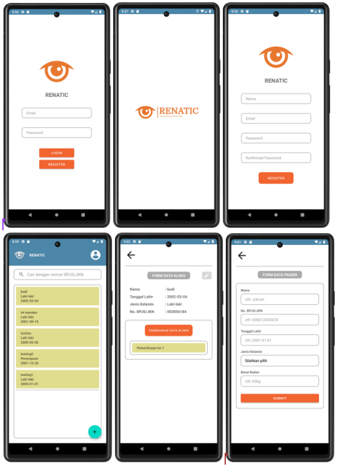
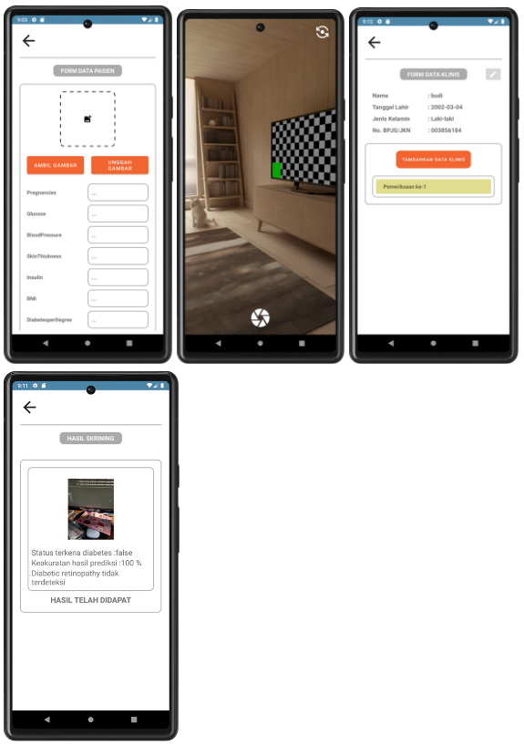

  <h1>👁️ Renatic APP 👁️</h1>
  
  This repo is a personal repository containing the Android project files used to build the eye-detecting diabetes App as a final project in Bangkit Academy 2023.
  If you want to get to know more about the project, you can open this [link](https://github.com/Renatic-C23-PR504)

  ## Screenshot

  
  

  ## Creator
| Members                                  | Github                                                                                                                                           | LinkedIn                                                                                                                                                                         |
| ---------------------------------------  | ------------------------------------------------------------------------------------------------------------------------------------------------ | ------------------------------------------------------------------------------------------------------------------------------------------------------------------------ |
| Lukman Sanusi - A166DKX4114              |      |   |

